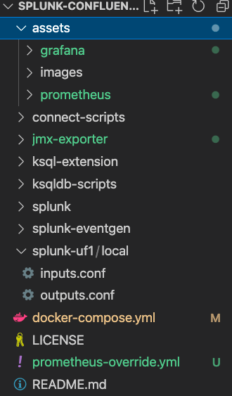
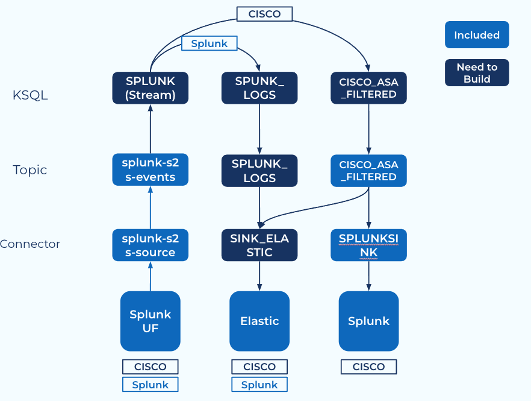

#  Splunkにフィードされるネットワーク機器 (Cisco ASA) のログデータをConfluentで加工する実験環境 (Sandbox)

## Overview

ネットワーク機器のログをSplunkのUniversal Forwarderを利用してConfluentに転送し、ストリーム処理後にSplunkのHECに転送するサンドボックス環境。Splunk Universal Forwarderから送られるログを、Confluent内で機器ログ (CISCO ASA) とUniversal Forwarder自身のログ (SPLUNKD) にストリーム処理で分類。ストリーム処理にはksqlDBを利用。

オリジナルはJohnny MirzaのSplunk Demoであり利用しているほぼ全てのリソースは彼の準備したもの。 (https://github.com/JohnnyMirza/confluent_splunk_demo) 本リポジトリはその内容をカスタマイズし、日本語化したもの。

### 備考
- 必要なConnectorは起動時に取得/設定される。しかしEnd-to-Endで繋がってはいない為中間処理は追加する必要がある。処理はksqlDBで記載する事を想定しているが必要条件ではない。
- ネットワーク機器からのログはGeneratorを使い生成したもの。同じレコードセットが繰り返しGeneratorから送られる。
- Splunkもコンテナ稼働しておりSink Connectorも定義済み。
- ElasticならびにKibanaも定義されており起動している。但しConnectorは未定義。Connectorは読み込まれておりksqlDBにて登録/接続は可能。 (後述)
- 機器からのログはCISCO ASAのログだが他のログに切り替えも可能。（e.g. Nginx) ログ内容のカスタマイズも可能。

## 手順
このリポジトリをclone後、Docker Composeを起動。

```bash
git clone https://github.com/shinichi-hashitani/splunk-confluent-sandbox.git
cd splunk-confluent-sandbox
# 起動
docker-compose up -d
# Prometheus/Grafana観測をONにする場合は
docker-compose -f docker-compose.yml -f prometheus-override.yml up -d
# 停止/破棄
docker-compose down --remove-orphans
# 停止後、ドライブを全て初期化
docker volume prune
```

### AWS EC2の事前準備
本Sandboxはローカル (Mac OS) 環境で作成/確認している。AWS EC2上で稼働する為の手順は以下の通り。
1. EC2インスタンスの生成。
    - AWS Linux2を想定。他でも動くが手順がやや異なる可能性あり。
    - t2.xlarge (4 core/16G) で確認。リソースにはだいぶ余裕あり。
    - Diskは50G程度割り当て。 (連続起動時間によってはもっと少なくても可)
2. Inbound Rulesに TCP/9021 (Confluent Control Center) 及びTCP/8000 (Splunk) を追加。
    - Elastic/Kibanaを利用する際には TCP/3000 (Kibana) をさらに追加。
3. sshでアクセス (cloud-shellでは作業不可)
4. Dockerのインストール
    ```bash
    sudo yum update -y
    yum install curl git
    # Amazon Linux2 以外ではさらに以下を実行
    # sudo yum install amazon-linux-extras
    sudo amazon-linux-extras install docker
    sudo service docker start
    sudo usermod -a -G docker ec2-user
    # 確認
    docker info
    # Docker Composeの取得。不格好だがバイナリをそのまま取得
    sudo curl -L https://github.com/docker/compose/releases/download/v2.2.3/docker-compose-linux-x86_64 -o /usr/local/bin/docker-compose
    sudo chmod 755 /usr/local/bin/docker-compose
    ```

## リポジトリ構成構成

- assets/Grafana  
データソース定義ならびに各Confluentコンポーネント毎のダッシュボード定義。
- assets/prometheus  
prometheus.ymlおよびalert.rules。
- connect_scripts  
Connect Cluster起動時の実行スクリプト。具体的にはConnector (Splunk Connector, etc.) の取得とConnectorの登録。
- ksql-scripts  
ksqlDB Server用ではなく別途立ち上げるksqlDB Client用のスクリプト。 ksqlDB Serverのプロパティ (KSQL_QUERIES_FILE)にこのパスを指定するとksqlDBをHeadlessモードで起動する事も可能。
- splunk  
Splunkのプロパティファイル
- splunk-eventgen/eventgen.conf  
使用するサンプルデータの定義。現在はcisco:asaを指定。
- splunk-eventgen/samples  
サンプルデータ。加工することによりデータのカスタマイズが可能。
- splunk-uf1  
Universal Forwarderのin/out定義設定。

## 環境アクセス
** 管理コンソール (Control Center及びSpluk) にアクセスするには、それぞれ外部から対象ポート (9021及び8000) へのアクセスを許容する必要があります。

Confluent Control Center
```bash
http://<Server FQDN>:9021 
```

Splunk
```bash
http://<Server FQDN>/en-GB/app/search/search
user: admin
password: Password1
```

Kibana (Elastic)
```bash
http://<Server FQDN>:5601 
```

Grafana
```bash
http://<Server FQDN>:3000
user: admin
password: password
```

## 作業手順

### 1. Creating a Stream
Splunk UFから渡ってきたログはsplunk-s2s-eventsというEventに送られている。このTopicをストリーム化。
```sql
CREATE STREAM SPLUNK (
`event` VARCHAR,
`time` BIGINT,
`host` VARCHAR,
`source` VARCHAR,
`sourcetype` VARCHAR,
`index` VARCHAR
) WITH (
KAFKA_TOPIC='splunk-s2s-events', VALUE_FORMAT='JSON');
```
### 2. ソースからSplunk UFのログを抽出
StreamからSplunkのログを抽出（出力先はElastic）
```sql
CREATE STREAM SPLUNK_LOGS
AS SELECT
    `event`,
    `host`,
    `source`,
    `sourcetype`,
    `index`
FROM SPLUNK
WHERE SPLUNK.`sourcetype` = 'splunkd'
EMIT CHANGES;
```
### 3. ソースから機器 (CISCO ASA) のログのみ抽出
Streamから機器のログを抽出　（出力先はSplunk）
```sql
CREATE STREAM CISCO_ASA_FILTERED
AS SELECT
    SPLUNK.`event` `event`,
    SPLUNK.`source` `source`,
    SPLUNK.`sourcetype` `sourcetype`,
    SPLUNK.`index` `index`
FROM SPLUNK
WHERE ((SPLUNK.`sourcetype` = 'cisco:asa') AND (NOT (SPLUNK.`event` LIKE '%ASA-4-106023%')))
EMIT CHANGES;
```

### 4. ElasticsearchのConnectorを登録
2及び3で作成したStream (`CISCO_ASA_FILTERED` と `SPLUNK_LOGS`) をElasticsearchに流すConnector。
```sql
CREATE SINK CONNECTOR SINK_ELASTIC WITH (
    'connector.class' = 'io.confluent.connect.elasticsearch.ElasticsearchSinkConnector',
    'topics' = 'SPLUNK_LOGS, CISCO_ASA_FILTERED',
    'key.converter' = 'org.apache.kafka.connect.storage.StringConverter',
    'value.converter' = 'org.apache.kafka.connect.json.JsonConverter',
    'value.converter.schemas.enable' = 'false',
    'connection.url' = 'http://elasticsearch:9200',
    'type.name' = '_doc',
    'key.ignore' = 'true',
    'schema.ignore'  = 'true'
);
```

## Observability with Promethes/Grafana
設定、Grafanaダッシュボードの定義等は以下を参考：
https://github.com/confluentinc/jmx-monitoring-stacks/


Dashboards/Manage配下にOverview、Kafka Cluster、Consumer等10のダッシュボードが用意されている。


## 参考
- ksqlDB Website  
https://ksqldb.io/
- Confluent: ksqlDB 101
https://developer.confluent.io/learn-kafka/ksqldb/intro/
- Confluent: Inside ksqlDB  
https://developer.confluent.io/learn-kafka/ksqldb/intro/
- Confluent: ksqlDB Product Page
https://www.confluent.io/product/ksql/
- "Mastering Kafka Streams and ksqlDB" (Free eBook)  
https://www.confluent.io/ja-jp/resources/ebook/mastering-kafka-streams-and-ksqldb/